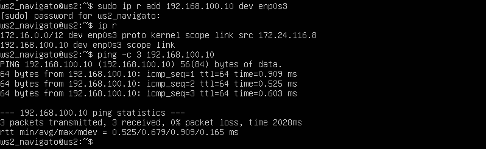

## Part 1. Инструмент ipcalc

##### Поднять виртуальную машину (далее -- ws1)

Устанавливаем Ubuntu 20.04 Server LTS


#### 1.1. Сети и маски
##### Определить и записать в отчёт:
##### 1) Адрес сети *192.167.38.54/13*

Для возможности работы с ipcalc нужно его установить командой  `sudo apt install ipcalc`.


Определить адрес сети можно командой `ipcalc 192.167.38.54/13`


Адрес 192.167.38.54
	
##### 2) Перевод маски *255.255.255.0* в префиксную и двоичную запись, */15* в обычную и двоичную, *11111111.11111111.11111111.11110000* в обычную и префиксную

Представление маски `255.255.255.0` в префиксной и двоичной записи

	
Представление маски `/15` в обычную и двоичную

	
Представление маски `11111111.11111111.11111111.11110000` в обычную и префиксную.


##### 3) Минимальный и максимальный хост в сети 12.167.38.4 при масках: /8, 11111111.11111111.00000000.00000000, 255.255.254.0 и /4

Минимальный и максимальный хост в сети 12.167.38.4 при маске `/8`

	
Минимальный и максимальный хост в сети 12.167.38.4 при маске `11111111.11111111.00000000.00000000`

	
Минимальный и максимальный хост в сети 12.167.38.4 при маске `255.255.254.0`

	
Минимальный и максимальный хост в сети 12.167.38.4 при маске `/4`


#### 1.2. localhost
##### Определить и записать в отчёт, можно ли обратиться к приложению, работающему на localhost, со следующими IP: *194.34.23.100*, *127.0.0.2*, *127.1.0.1*, *128.0.0.1*

127.0.0.0 — 127.255.255.255 Зарезервирован для интерфейсов обратной связи (не используется для связи между узлами сети), так называемый localhost; исходя из этого:
К IP *194.34.23.100*, *128.0.0.1* - обратиться нельзя;
К IP *127.0.0.2*, *127.1.0.1* - обратиться можно.

#### 1.3. Диапазоны и сегменты сетей
##### Определить и записать в отчёт:
##### 1) какие из перечисленных IP можно использовать в качестве публичного, а какие только в качестве частных: *10.0.0.45*, *134.43.0.2*, *192.168.4.2*, *172.20.250.4*, *172.0.2.1*, *192.172.0.1*, *172.68.0.2*, *172.16.255.255*, *10.10.10.10*, *192.169.168.1*

 Следующие диапазоны адресов зарезервированы для частных сетей:
- *10.0.0.0* — *10.255.255.255* (*10.0.0.0/8*),
- *172.16.0.0* — *172.31.255.255* (*172.16.0.0/12*),
- *192.168.0.0* — *192.168.255.255* (*192.168.0.0/16*).

Исходя из этого IP:
*10.0.0.45*, *192.168.4.2*, *172.20.250.4*, *172.16.255.255*, *10.10.10.10* - можно использовать в качестве частных;
*134.43.0.2*, *172.0.2.1*, *192.172.0.1*, *172.68.0.2*, *192.169.168.1* - можно использовать в качестве публичных;
	
##### 2) какие из перечисленных IP адресов шлюза возможны у сети *10.10.0.0/18*: *10.0.0.1*, *10.10.0.2*, *10.10.10.10*, *10.10.100.1*, *10.10.1.255*

Шлюзы, возможные у сети *10.10.0.0/18*: `10.10.0.2, 10.10.10.10, 10.10.1.255`
Диапазон шлюзов для этой сети выделен на скриншоте
	
	
## Part 2. Статическая маршрутизация между двумя машинами

##### Поднять две виртуальные машины (далее -- ws1 и ws2)


##### С помощью команды `ip a` посмотреть существующие сетевые интерфейсы
	
Сетевые интерфейсы машины `ws1`
	
	
Сетевые интерфейсы машины `ws2`
		
	
##### Описать сетевой интерфейс, соответствующий внутренней сети, на обеих машинах и задать следующие адреса и маски: ws1 - *192.168.100.10*, маска */16*, ws2 - *172.24.116.8*, маска */12*
	
Для записи адреса с маской потребуется внести правки в файл, используя команду `sudo vim /etc/netplan/00-installer-config.yaml`.
Значение DHCP меняем с `true` на `false` - это делается для отключения получения IP адреса по DHCP.

Внесенные правки в файл для машины ws1
	

Результат выполнения команды netplan apply для перезапуска сервиса сети машины ws1
 

Внесенные правки в файл для машины ws2
	

Результат выполнения команды `sudo netplan apply` для перезапуска сервиса сети машины ws2


#### 2.1. Добавление статического маршрута вручную
##### Добавить статический маршрут от одной машины до другой и обратно при помощи команды вида `ip r add`

Перед добавлением и пингованием следует в настройках каждой машины провести настройку `адаптера 1`. Это делается через:
```
Настроить -> Сеть -> Адаптер 1 -> Тип подключения -> Внутренняя сеть
Настроить -> Сеть -> Адаптер 1 -> Дополнительно -> Разрешить всё
```
После нажимаем на клавишу `Ok`

На скрине добавление статического маршрута от **ws1** к **ws2** командой `sudo ip r add 172.24.116.8 dev enp0s3` и результат пингования


На скрине добавление статического маршрута от **ws2** к **ws1** командой `sudo ip r add 192.168.100.10 dev enp0s3` и результат пингования


#### 2.2. Добавление статического маршрута с сохранением
##### Перезапустить машины
##### Добавить статический маршрут от одной машины до другой с помощью файла *etc/netplan/00-installer-config.yaml*

После перезапуска машин открываем файл в машине `ws1` и вносим правки


То же самое вносим правки в файле машины `ws2`


Применяем на `ws1` внесенные правки командной `sudo netplan apply` и пингуем соединение от `ws1` к `ws2`


Применяем на `ws2` внесенные правки командной `sudo netplan apply` и пингуем соединение от `ws2` к `ws1`


## Part 3. Утилита **iperf3**

#### 3.1. Скорость соединения
##### Перевести и записать в отчёт: 8 Mbps в MB/s, 100 MB/s в Kbps, 1 Gbps в Mbps

8 Mbps = 1 MB/s
100 MB/s = 819200 Kbps
1 Gbps = 1000 Mbps

#### 3.2. Утилита **iperf3**
##### Измерить скорость соединения между ws1 и ws2

- Для измерения скорости соединения между машинами `ws1` и `ws2` посредством утилиты `iperf3` нужно её установить.
Машины нужно привести к состоянию в части 2. Лишнее можно удалить, либо закомментировать, не забыв применить настройки.

На скрине закомментировано лишнее у машины `ws1`


На скрине закомментировано лишнее у машины `ws2`


`ws1` назначена как сервер и по умолчанию слушает порт 5201. Используем команду `sudo iperf3 -s` для замера скорости.


Машина `ws2`. Используется команда `sudo iperf3 -с 192.168.100.10 -p 5201` для замера скорости.


## Part 4. Сетевой экран

Cтоит следующая задача: контролировать информацию, проходящую по соединению. Для этого используются сетевые экраны.
В данном задании используются виртуальные машины `ws1` и `ws2` из Части 2.

#### 4.1. Утилита iptables

##### Создать файл /etc/firewall.sh, имитирующий фаерволл, на ws1 и ws2:

##### Нужно добавить в файл подряд следующие правила:
##### 1) на ws1 применить стратегию когда в начале пишется запрещающее правило, а в конце пишется разрешающее правило (это касается пунктов 4 и 5)
##### 2) на ws2 применить стратегию когда в начале пишется разрешающее правило, а в конце пишется запрещающее правило (это касается пунктов 4 и 5)
##### 3) открыть на машинах доступ для порта 22 (ssh) и порта 80 (http)
##### 4) запретить *echo reply* (машина не должна "пинговаться”, т.е. должна быть блокировка на OUTPUT)
##### 5) разрешить *echo reply* (машина должна "пинговаться")
- В отчёт поместить скрины с содержанием файла */etc/firewall* для каждой машины.

Создание файла для `ws1` с добавлением правил


Создание файла для `ws2` с добавлением правил


##### Запустить файлы на обеих машинах командами `chmod +x /etc/firewall.sh` и `/etc/firewall.sh`
- В отчёт поместить скрины с запуском обоих файлов.

Запуск файла для виртуальной машины `ws1`


Запуск файла для виртуальной машины `ws2`


- В отчёте описать разницу между стратегиями, применёнными в первом и втором файлах.

> Правила в iptables применяются иерархически, т.е. правило стоящее выше выполнится раньше.
> В первой стратегии стоит `DROP`, значит после этого запрещаются любые действия в отдельно взятой цепочке.
> Во второй стратегии разрешаются любые действия пока нет запрета. После запрета все действия невозможны в данной цепочке.

#### 4.2. Утилита **nmap**
##### Командой **ping** найти машину, которая не "пингуется", после чего утилитой **nmap** показать, что хост машины запущен
*Проверка: в выводе nmap должно быть сказано: `Host is up`*
- В отчёт поместить скрины с вызовом и выводом использованных команд **ping** и **nmap**.

Машина `ws2` не пингуется, в выводе nmap показано, что `Host is up`


## Part 5. Статическая маршрутизация сети

##### Поднять пять виртуальных машин (3 рабочие станции (ws11, ws21, ws22) и 2 роутера (r1, r2))

#### 5.1. Настройка адресов машин
##### Настроить конфигурации машин в *etc/netplan/00-installer-config.yaml* согласно сети на рисунке.


- В отчёт поместить скрины с содержанием файла *etc/netplan/00-installer-config.yaml* для каждой машины.

Скрин настроек файла *etc/netplan/00-installer-config.yaml* роутера `r1`


Скрин настроек файла *etc/netplan/00-installer-config.yaml* машины `ws11`


Скрин настроек файла *etc/netplan/00-installer-config.yaml*  роутера `r2`


Скрин настроек файла *etc/netplan/00-installer-config.yaml* машины `ws21`


Скрин настроек файла *etc/netplan/00-installer-config.yaml* машины `ws22`


##### Перезапустить сервис сети. Если ошибок нет, то командой `ip -4 a` проверить, что адрес машины задан верно. Также пропинговать ws22 с ws21. Аналогично пропинговать r1 с ws11.
- В отчёт поместить скрины с вызовом и выводом использованных команд.	

`r1`, перезапуск сети, вывод командой `ip -4 a`


`ws11`, перезапуск сети, вывод командой `ip -4 a`, пингование от `ws11` к `r1`


`r2`, перезапуск сети, вывод командой `ip -4 a`


`ws21`, перезапуск сети, вывод командой `ip -4 a`, пингование от `ws21` к `ws22`


`ws22`, перезапуск сети, вывод командой `ip -4 a`


#### 5.2. Включение переадресации IP-адресов.
##### Для включения переадресации IP, выполните команду на роутерах:
`sysctl -w net.ipv4.ip_forward=1`
*При таком подходе переадресация не будет работать после перезагрузки системы.*
- В отчёт поместить скрин с вызовом и выводом использованной команды.

> Чтобы настройки вступили в силу нужно ввести следующую команду `sysctl --system`

Скрин для роутера `r1` с вызовом и выводом использованной команды.


Скрин для роутера `r2` с вызовом и выводом использованной команды.


##### Откройте файл */etc/sysctl.conf* и добавьте в него следующую строку:
`net.ipv4.ip_forward = 1`
*При использовании этого подхода, IP-переадресация включена на постоянной основе.*
- В отчёт поместить скрин с содержанием изменённого файла */etc/sysctl.conf*.

Скрин для роутера `r1` с содержанием изменённого файла */etc/sysctl.conf*.


Скрин для роутера `r2` с содержанием изменённого файла */etc/sysctl.conf*.


#### 5.3. Установка маршрута по-умолчанию
##### Настроить маршрут по-умолчанию (шлюз) для рабочих станций. Для этого добавить `default` перед IP роутера в файле конфигураций
- В отчёт поместить скрин с содержанием файла *etc/netplan/00-installer-config.yaml*.

скрин для `ws11` с содержанием файла etc/netplan/00-installer-config.yaml.


скрин для `ws21` с содержанием файла etc/netplan/00-installer-config.yaml.


скрин для `ws22` с содержанием файла etc/netplan/00-installer-config.yaml.


##### Вызвать `ip r` и показать, что добавился маршрут в таблицу маршрутизации
- В отчёт поместить скрин с вызовом и выводом использованной команды.

Скрин для машины `ws11` с вызовом и выводом команды `ip r`.


Скрин для машины `ws21` с вызовом и выводом команды `ip r`.


Скрин для машины `ws22` с вызовом и выводом команды `ip r`.


##### Пропинговать с ws11 роутер r2 и показать на r2, что пинг доходит. Для этого использовать команду:
`tcpdump -tn -i eth1`
- В отчёт поместить скрин с вызовом и выводом использованных команд.

Пингование с машины `ws11` на роутер `r2`.


Скрин с информацией о прохождении пинга с машины `ws11` на роутер `r2`.


#### 5.4. Добавление статических маршрутов
##### Добавить в роутеры r1 и r2 статические маршруты в файле конфигураций.
- В отчёт поместить скрины с содержанием изменённого файла *etc/netplan/00-installer-config.yaml* для каждого роутера.

Скрин с добавленными статическими маршрутами на роутере `r1`.


Скрин с добавленными статическими маршрутами на роутере `r2`.


##### Вызвать `ip r` и показать таблицы с маршрутами на обоих роутерах.

- В отчёт поместить скрин с вызовом и выводом использованной команды.

Скрин с вызовом команды `ip r` и отображеним таблицы с маршрутами на роутере `r1`.


Скрин с вызовом команды `ip r` и отображеним таблицы с маршрутами на роутере `r2`.


##### Запустить команды на ws11:
`ip r list 10.10.0.0/[маска сети]` и `ip r list 0.0.0.0/0`
- В отчёт поместить скрин с вызовом и выводом использованных команд.

Скрин с вызовом и выводом использованных команд на машине `ws11`.


- В отчёте объяснить, почему для адреса 10.10.0.0/\[порт сети\] был выбран маршрут, отличный от 0.0.0.0/0, хотя он попадает под маршрут по-умолчанию.

> При переадресации пакета более длинным префиксам всегда отдается предпочтение над короткими. По этой причине путь 0.0.0.0/0 не будет выбран при наличии маски /18.

#### 5.5. Построение списка маршрутизаторов
##### Запустить на r1 команду дампа:
`tcpdump -tnv -i eth0`

Скрин с вызовом на роутере `r1` команды `tcpdump -tnv -i eth0`


Скрин с выводом на роутере `r1` команды `tcpdump -tnv -i eth0`


##### При помощи утилиты **traceroute** построить список маршрутизаторов на пути от ws11 до ws21

Скрин с вызовом и выводом на `ws11` команды `traceroute 10.20.0.10`


- В отчёте, опираясь на вывод, полученный из дампа на r1, объяснить принцип работы построения пути при помощи **traceroute**.

> Для определения промежуточных маршрутизаторов `traceroute` отправляет целевому узлу серию ICMP-пакетов (по умолчанию 3 пакета), с каждым шагом увеличивая значение поля TTL ("время жизни") на 1.

#### 5.6. Использование протокола **ICMP** при маршрутизации
##### Запустить на r1 перехват сетевого трафика, проходящего через eth0 с помощью команды:
`tcpdump -n -i eth0 icmp`
##### Пропинговать с ws11 несуществующий IP (например, *10.30.0.111*) с помощью команды:
`ping -c 1 10.30.0.111`
- В отчёт поместить скрин с вызовом и выводом использованных команд.

Запуск на r1 перехват сетевого трафика, проходящего через eth0


Пинг с ws11 несуществующего IP *10.30.0.111* с помощью команды: `ping -c 1 10.30.0.111`


Вывод на r1 перехват сетевого трафика, проходящего через eth0


## Part 6. Динамическая настройка IP с помощью **DHCP**

##### Для r2 настроить в файле */etc/dhcp/dhcpd.conf* конфигурацию службы **DHCP**:
##### 1) указать адрес маршрутизатора по-умолчанию, DNS-сервер и адрес внутренней сети.

Для роутера `r2` скриншот файла */etc/dhcp/dhcpd.conf*


##### 2) в файле *resolv.conf* прописать `nameserver 8.8.8.8.`

Для роутера `r2` скриншот файла */etc/resolv.conf* 


##### Перезагрузить службу **DHCP** командой `systemctl restart isc-dhcp-server`. Машину ws21 перезагрузить при помощи `reboot` и через `ip a` показать, что она получила адрес. Также пропинговать ws22 с ws21.
- В отчёт поместить скрины с вызовом и выводом использованных команд.

Перезагрузка службы **DHCP** командой `systemctl restart isc-dhcp-server`


Машина `ws21` после перезагрузки через вывод команды `ip a`


На скриншоте результат пингования с `ws21` на `ws22`


##### Указать MAC адрес у ws11, для этого в *etc/netplan/00-installer-config.yaml* надо добавить строки: `macaddress: 10:10:10:10:10:BA`, `dhcp4: true`
- В отчёт поместить скрин с содержанием изменённого файла *etc/netplan/00-installer-config.yaml*.

Cкрин с содержанием изменённого файла *etc/netplan/00-installer-config.yaml*


##### Для r1 настроить аналогично r2, но сделать выдачу адресов с жесткой привязкой к MAC-адресу (ws11). Провести аналогичные тесты
- В отчёте этот пункт описать аналогично настройке для r2.

Для роутера `r1` скриншот файла */etc/dhcp/dhcpd.conf* с жесткой привязкой к MAC-адресу (ws11).


Для роутера `r1` скриншот файла */etc/resolv.conf* 


Перезагрузка службы **DHCP** командой `systemctl restart isc-dhcp-server`


Машина `ws11` до перезагрузки через вывод команды `ip a`


Машина `ws11` после перезагрузки через вывод команды `ip a`


##### Запросить с ws21 обновление ip адреса
- В отчёте поместить скрины ip до и после обновления.
- В отчёте описать, какими опциями **DHCP** сервера пользовались в данном пункте.

> В даннном пункте использовалась команда `sudo dhclient eth0` для запроса ip.

Скриншот ip до обновления на машине `ws21`


Скриншот ip после обновления на машине `ws21` + дополнительная проверка на пинг


## Part 7. **NAT**
##### В файле */etc/apache2/ports.conf* на ws22 и r1 изменить строку `Listen 80` на `Listen 0.0.0.0:80`, то есть сделать сервер Apache2 общедоступным
- В отчёт поместить скрин с содержанием изменённого файла.

Скрин с содержанием изменённого файла для машины `ws22`


Скрин с содержанием изменённого файла для роутера `r1`


##### Запустить веб-сервер Apache командой `service apache2 start` на ws22 и r1
- В отчёт поместить скрины с вызовом и выводом использованной команды.

Скрин с вызовом и выводом использованной команды для `ws22`


Скрин с вызовом и выводом использованной команды для `r1`


##### Добавить в фаервол, созданный по аналогии с фаерволом из Части 4, на r2 следующие правила:
##### 1) Удаление правил в таблице filter - `iptables -F`
##### 2) Удаление правил в таблице "NAT" - `iptables -F -t nat`
##### 3) Отбрасывать все маршрутизируемые пакеты - `iptables --policy FORWARD DROP`
##### Запускать файл также, как в Части 4
Добавляем в фаервол строки и запускаем командами `sudo chmod +x /etc/firewall.sh`, `sudo sh /etc/firewall.sh`.


##### Проверить соединение между ws22 и r1 командой `ping`
*При запуске файла с этими правилами, ws22 не должна "пинговаться" с r1*
- В отчёт поместить скрины с вызовом и выводом использованной команды.

Скрин с вызовом и выводом использованной команды для `r1`


##### Добавить в файл ещё одно правило:
##### 4) Разрешить маршрутизацию всех пакетов протокола **ICMP**
##### Запускать файл также, как в Части 4

Добавляем в файл /etc/firewall.sh строку `iptables -A FORWARD -p icmp -j ACCEPT`


> Запускаем командами `sudo chmod +x /etc/firewall.sh`, `sudo sh /etc/firewall.sh`.

##### Проверить соединение между ws22 и r1 командой `ping`
*При запуске файла с этими правилами, ws22 должна "пинговаться" с r1*
- В отчёт поместить скрины с вызовом и выводом использованной команды.

Проверка соединения от роутера `r1` к компьютеру `ws22`


##### Добавить в файл ещё два правила:
##### 5) Включить **SNAT**, а именно маскирование всех локальных ip из локальной сети, находящейся за r2 (по обозначениям из Части 5 - сеть 10.20.0.0)
*Совет: стоит подумать о маршрутизации внутренних пакетов, а также внешних пакетов с установленным соединением*
##### 6) Включить **DNAT** на 8080 порт машины r2 и добавить к веб-серверу Apache, запущенному на ws22, доступ извне сети
*Совет: стоит учесть, что при попытке подключения возникнет новое tcp-соединение, предназначенное ws22 и 80 порту*
- В отчёт поместить скрин с содержанием изменённого файла.
##### Запускать файл также, как в Части 4

Добавляем в файл /etc/firewall.sh строки и запускаем.


##### Проверить соединение по TCP для **SNAT**, для этого с ws22 подключиться к серверу Apache на r1 командой:
`telnet [адрес] [порт]`

Проверка соединения по TCP для **SNAT** с `ws22` на `r1`


##### Проверить соединение по TCP для **DNAT**, для этого с r1 подключиться к серверу Apache на ws22 командой `telnet` (обращаться по адресу r2 и порту 8080)
- В отчёт поместить скрины с вызовом и выводом использованных команд.

Проверка соединенения по TCP для **DNAT** с `r1` на `ws22`, обращаясь к `r2`


## Part 8. Дополнительно. Знакомство с **SSH Tunnels**
##### Запустить на r2 фаервол с правилами из Части 7

Запуск на роутере `r2` фаервола с правилами из части 7


##### Запустить веб-сервер **Apache** на ws22 только на localhost (то есть в файле */etc/apache2/ports.conf* изменить строку `Listen 80` на `Listen localhost:80`)

Открываем файл, вносим правки, сохраняем и применяем команду `service apache2 start`


##### Воспользоваться *Local TCP forwarding* с ws21 до ws22, чтобы получить доступ к веб-серверу на ws22 с ws21

> *Local TCP forwarding* - локальная пересылка представляет собой преброс порта из клиентской системы на сервер. позволяет настроить так, чтобы соединения на этот порт проходили через туннель SSH.

Для получения доступа к веб-серверу на ws22 с ws21 вводим команду `ssh -L 9999:localhost:80 10.20.0.20`


Для проверки, сработало ли подключение выполняем команду `telnet 127.0.0.1 80`


##### Воспользоваться *Remote TCP forwarding* c ws11 до ws22, чтобы получить доступ к веб-серверу на ws22 с ws11

> *Remote TCP forwarding* - проброс удаленного порта на локальный компьютер. Позвляет соединить через SSH сервер компьютеры без белых ip-адресов или находящихся за NAT.
> Для получения доступа к веб-серверу на ws22 с ws11 вводим `ssh -R 9999:localhost:80 ws1_navigato@10.20.0.20`. Для проверки, сработало ли подключение выполняем команду `telnet 127.0.0.1 9999`

Результат применения вышеописанных действий для получения доступа к веб-серверу на ws22 с ws11


##### Сохранить дампы образов виртуальных машин
Сохранены дампы для частей 4, 5, 7 и 8.


